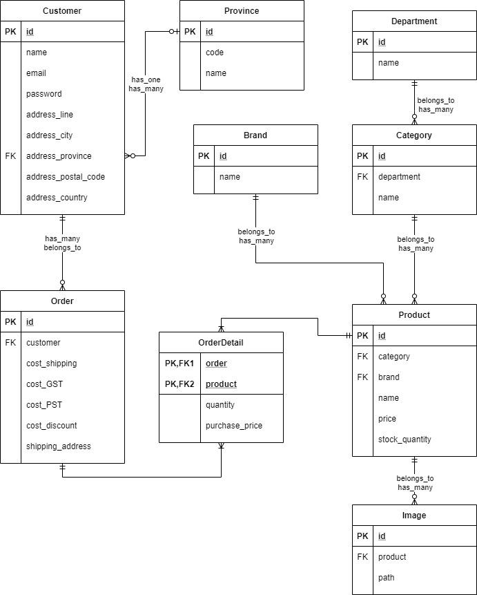

# E-Commerce Project - Nerdstore

## Pages Planning

- Page Page
    - **"/"**
    - `product#index`
    - Shows a select number of products from within a few categories
    - **"/account"**
    - `controller#account`
    - When not logged in: Shows the account page, where it will show login and register forms.
    - When logged in: Shows the profile page, with an `Orders` tab and a `Account Profile` tab
    - **"/about"**
    - `controller#about`
    - Shows the about page
    - **"/contact"**
    - `controller#contact`
    - Shows the contact page
    - **"/cart"**
    - `controller#cart`
    - Shows the cart content
    - **"/checkout"**
    - `controller#checkout`
    - Goes to the checkout workflow
- Department Page
    - **"/department/{name}"**
    - `controller#show`
    - We only need the show page. The show page will show items that belongs to that department, and a submenu in the side with all categories from this department
- Category Page
    - **"/category"**
    - `controller#index`
    - **"/category/{name}"**
    - `controller#show`
    - We only need the index and show pages.
    - The index page will redirect to this category's `department#show` page.
    - The show page will show items that belongs to that category, and a submenu in the side with all categories from this department
- Product Page
    - **"/"**
    - `controller#index`
    - **"/product/{name}"**
    - `controller#show`
    - We only need the index and show pages.
    - Index page will be the landing page.
    - Show page shows that specific product with details

## Rails Commands to generate Models and Controllers

### Models

- Commands used to generate the Models:
    - rails g model Province code:string name:string
    - rails g model Customer name:string email:string password:string address_line:string city:string postal_code:string country:string province:references
    - rails g model Brand name:string
    - rails g model Department name:string
    - rails g model Category name:string department:references
    - rails g model Product name:string description:text price:decimal stock_quatity:integer brand:references category:references
    - rails g model Image path:string position_order:integer product:references
    - rails g model Order cost_shipping:decimal cost_GST:decimal cost_PST:decimal cost_HST:decimal cost_discount:decimal shipping_address:string
- Relationship Models
    - rails g model OrderDetail product:references order:references quatity:integer purchase_price:decimal

### Controllers

- Commands used to generate Controllers
    - rails g controller pages account about contact cart checkout
    - rails g controller departments show
    - rails g controller categories index show
    - rails g controller products index show
    - rails g controller brands index show
    - rails g controller orders index show
    - rails g controller checkout

### Active Admin tabs

- Commands used to generate active admin tabs to add data
    - rails g active_admin:resource Province
    - rails g active_admin:resource Customer
    - rails g active_admin:resource Order
    - rails g active_admin:resource Brand
    - rails g active_admin:resource Department
    - rails g active_admin:resource Category
    - rails g active_admin:resource Product

### Migrations

- Commands used to generate Migrations later
    - rails g migration rename_column_products_fix_quantity
    - rails g migration fix_order_detail_reference
    - rails g migration add_customer_to_orders customer:references
    - rails g migration add_tax_pst_to_provinces tax_pst:decimal
    - rails g migration add_tax_gst_to_provinces tax_gst:decimal
    - rails g migration add_tax_hst_to_provinces tax_hst:decimal
    - rails g migration add_status_to_orders status:string

## Images info

- Sizes
    - Fullsize: 670x670
    - Thumbnail: 208x208

## External Packages used

gem "nokogiri" # for web scraping
gem "kaminari" # for pagination
gem "twitter" # twitter API

- nokogiri
    - Used for web scrapping
- kaminari
    - Used for for pagination
- twitter
    - Used for accessing twitter API
- Stripe
    - Used for processing payments

## Possibly Missing TO-DOs

- [x] Clean up unneccessary code in application.scss
- [x] Fix and clean up `navigation_bar` and `header_bar` partials
- [x] Update the other index and show pages (departments categories brands)
- [x] Add Breadcrumbs
- [x] Add seed for Provinces
- [x] Add pagination in products listings.
- [x] Add filtering in products listings.
- [x] Add searching
- [X] Implement Twitter Bot
    - [X] Every time you hit search, twitter bot will post?
- [] Setup the purchasing process
    - [x] Setup Cart
    - [] Setup Orders
    - [] Setup checkout
    - [] Setup User Accounts
- [] Add seed for Customer
- [] Add contact form to contact page

- [] Add status to order (pending paid shipped)
- [] Add tax rate for each province
- [] Maybe will need to add active admin for `OrderDetail` and `Image`

- [] Being able to edit contact and about page. Worth 2PTs
- [] Convert css to use scss variables etc. Worth 2PTs

## For future Reference

- Hogwarts on rails 4: page permalink
- Horses on rails 2: Search form
- Horses on rails 3: ActiveAdmin and ActiveStorage

## ERD Diagram

    

## To add Sales later maybe?

Sales table
# id
# name
# value (10)
# type ($ / %)
# products (fk_has_many)
has_many: products

Products table
# sale (fk_belongs_to)
belongs_to :sale, optional: true